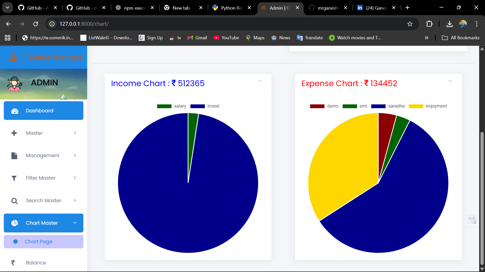

# 💰 CashPilot

**CashPilot** is a digital financial assistant designed to simplify personal finance management.  
With features for expense tracking, budgeting, and financial reporting, it empowers users to stay in control of their money.  
Built with **Django**, **MySQL**, and modern web technologies, it provides a smooth and efficient user experience.  

---

## 🎯 Features
- ✅ Intuitive and user-friendly interface  
- ✅ Track expenses and manage budgets  
- ✅ Generate real-time financial insights and reports  
- ✅ Export and manage your financial data  
- ✅ Responsive design powered by Bootstrap  

---

## ⚙️ Prerequisites
- Python **3.9+** → [Download here](https://www.python.org/downloads/)  

---

## 🔧 Installation

**Step 1: Clone the repository**  
```bash
git clone https://github.com/your-username/CashPilot.git
cd CashPilot
```

**Step 2: Create a virtual environment**  
```bash
python -m venv venv
```

**Step 3: Activate the environment**  
```bash
venv\Scripts\activate   # On Windows
source venv/bin/activate   # On Linux/Mac
```

**Step 4: Install dependencies**  
```bash
pip install -r requirements.txt
```

---

## ⚡ Configuration

Update the configuration file with your email credentials:  

**Path:** `wallet/config.py`  
```python
email = ""
password = ""
```

---

## 🔑 Default Credentials

| Username | Password   |  
|----------|------------|  
| admin    | admin@123  |  

---

## 🖼️ Screenshots

### 🔐 Login


### 🏠 Home


### ➕ Add Expense


### 📊 Dashboard


### 📈 Financial Chart


---

## 🚀 Run the Application
```bash
python manage.py runserver
```

Open in your browser: [http://127.0.0.1:8000](http://127.0.0.1:8000)
